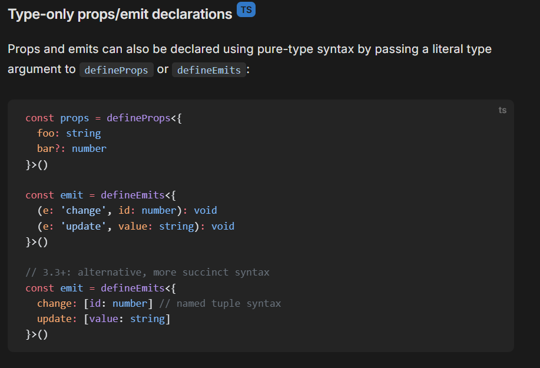
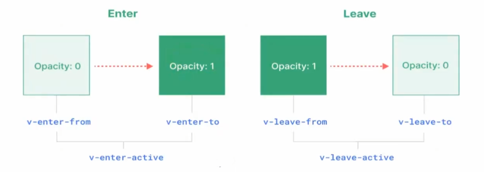

# part.2 Collapse
> 折叠面板

#### 架构部分
1. 父组件 + item 构型, 子组件承载内容
2. 使用`__` 命名子元素, 使用`--`开头命名可变`class`
```ts
<template>
    <div class='ws-collapse-item'
    :class="{
        'is-disabled': disabled
    }"
    >
        <div class="ws-collapse__header">

        </div>
        <div class="ws-collapse__content">

        </div>
    </div>
</template>
```
3. 父子组件沟通使用`provide/inject` 传递`collpaseItemProvider`,维护一个包含所有激活状态的Item的名称的队列,以及维护队列的函数
```typescript
/// 创建 provide/inject 来使得父组件信息透传到slot中的子组件上。
export interface CollapseProviderType{
    ItemActivateList: Ref<CollapseItemNameType[]>,
    handleItemClick: (item: CollapseItemNameType) => void;
}
/// 创建一个透传的全局Key type: 
export const CollapseProviderKey = Symbol('collapseItemProvider') as InjectionKey<CollapseProviderType>; 
``` 
4. 支持`v-model`属性以支持使用变量控制开合,`v-model`分解为 `{绑定属性(modelvalue) + 事件函数update\change}`  
 
并当属性改变时，维护`ActivateItemList`
```ts
watch(() => props.modelValue, ()=>{
        ItemActivateList.value = props.modelValue ?? [];
    })
```

#### 样式部分
1. 添加`Transition` 动画效果
 
- 使用css样式控制在`enter/leave`不同阶段的样式
```sass
.slide-enter-active,.slide-leave-active {
  transition: opacity .5s ease-in-out;
}

```
- 使用js钩子精细控制样式中的变量，提取`Html`元素的属性进行计算。
重载预留的钩子，读取`Dom`属性的方式与css中 `transition`联动,实现动画效果。
```ts
/// v-on 至 Transition
    const transitionEvents : Record<string, (el: HTMLElement) => void> = {
      'before-enter'(el){
        el.style.height = '0px';
      },
      'enter'(el){
        el.style.height = `${el.scrollHeight}px`; /// 读取组件高度
      },
      'after-enter'(el){
        el.style.height = '';
      },
      'before-leave'(el){
        el.style.height = `${el.scrollHeight}px`;
      },
      'leave'(el){
        el.style.height = '0px';
      },
      'after-leave'(el){
        el.style.height = '';
      }
    };
```

